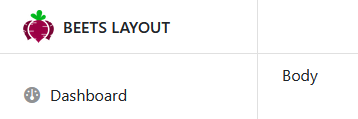

## Structure

The `.header__logo` wrapper is used to give a logo asset the correct size within the header, be it in `.sidebar__header` or `.bl__header`.



### Example in the sidebar

```html
<aside class="bl__sidebar">
	<div class="sidebar__header">
		<div class="header__logo">
			
		</div>
	</div>
</aside>
```

### Example in the main header

```html
<header class="bl__header">
	<div class="header__logo">
		
	</div>
</header>
```

## CSS

The logo image height is max 60% of the header height and the width is max the width of the sidebar minus the left and right padding.

### Sass variables

```scss title="src/scss/beets-layout/_variables.scss"
$logo-img-height: $header-height * 0.6;
$logo-img-width: $sidebar-width - (#{$gutter-x * 2});
```