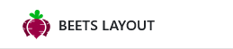
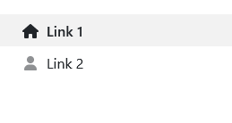
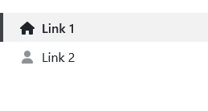
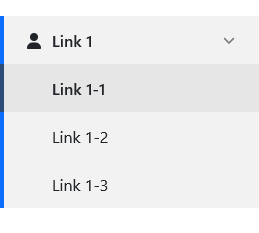

The sidebar stretches from top to bottom of the viewport and is rendered before the `.bl__main` section.

## Structure

Inside the sidebar there are tree sections that can contain different content: `.bl__header`, `.bl__body` and `.bl__footer`.


```html
<aside class="bl__sidebar">
	<div class="sidebar__header">
		<div class="header__logo">
			
		</div>
	</div>

	<div class="sidebar__body">
		<nav class="sidebar__nav">
			<!-- Navigation here -->
		</nav>
	</div>

	<div class="sidebar__footer">
		Sidebar Footer
	</div>
</aside>
```

## Collapsible sidebar

By default the sidebar will not collapse on smaller viewports. If you want that functionality, you need to add the class `.sidebar-collapse` to `.bl__sidebar`.

```html
<aside class="bl__sidebar sidebar-collapse">
	...
</aside>
```

## Styling

`.sidebar-dark`

Beets Layout does not implement "themes" but you can still do some easy styling to make the sidebar look like you want.

By default the sidebar is white with darker elements. You can invert the colors to work on a darker background by adding the `.sidebar-dark` class to `.bl__sidebar`. You can then add a background color using Bootstrap classes or your own custom css.

=== "Default"

	

	```html
	<aside class="bl__sidebar">
		...
	</aside>
	```

=== "Dark"

	

	```html
	<aside class="bl__sidebar sidebar-dark bg-dark">
		...
	</aside>
	```
	*Using the Bootstrap class `.bg-dark`.*

=== "Custom"

	

	```html
	<aside class="bl__sidebar sidebar-dark" style="background-color: #045163;">
		...
	</aside>
	```

## Header

The sidebar header can for instance contain a logotype and a close button  that activates `toggleSidebar()` on click for when the sidebar is visible on small devices.

The following examples are using Bootstrap.

=== "Desktop"

	

=== "Mobile expanded"

	

```html
<div class="sidebar__header justify-content-between">
	<div class="header__logo">
		
		<span class="d-none d-lg-inline text-uppercase fw-semibold ms-2">
			Beets Layout
		</span>
	</div>
	<button class="btn btn-outline-secondary d-lg-none" onclick="toggleSidebar()">
		...
	</button>
</div>
```

## Body

This is the body and main content of the sidebar. You can place whatever you like in here but navigations and "call to actions" are probably most common.

### Divider

If you want to divide content, like two navigations or a cta and a navigation, you can use a `#!html <hr>` tag with the `.sidebar__divider` class.

```html
<button>Button</button>

<hr class="sidebar__divider">

<nav class="sidebar__nav">
	...
</nav>
```

## Navigation

The navigation section is placed inside `.sidebar__body`. There can be multiple navigations in the sidebar body.

```html
<div class="sidebar__body">
	<nav class="sidebar__nav">
		...
	</nav>
</div>
```

### Structure

Add the `.active` class to a `#!html <a class="nav_link"></a>` to style it as active.


```html
<nav class="sidebar__nav">
	<ul class="nav-list">
		<li class="list-item">
			<a href="#" class="nav-link active">
				<div class="nav-link-icon">...</div>
				Link 1
			</a>
		</li>
		<li class="list-item">
			<a href="#" class="nav-link">
				<div class="nav-link-icon">...</div>
				Link 2
			</a>
		</li>
	</ul>
</nav>
```

### Styles

#### Default

The default style is basic and offers a clean and minimalistic look. There is no class for this style as it is the default.

#### Simple

The simple style is modern and distinct and can be found on many other sites, like admin pages. Add the class `.nav-style__simple` to `.sidebar__navigation` to use it.

#### Rounded

The rounded style has a modern and playful feel to it. Add the class `.nav-style__rounded` to `.sidebar__navigation` to use it.

#### Examples

=== "Default"

	

	```html
	<nav class="sidebar__nav">
		...
	</nav>
	```

=== "Simple"

	

	```html
	<nav class="sidebar__nav nav-style__simple">
		...
	</nav>
	```

=== "Rounded"

	

	```html
	<nav class="sidebar__nav nav-style__rounded">
		...
	</nav>
	```

### Compact navigation

If you have many links in your navigation or if you have a secondary navigation that should be more subtle, you can use the compact style navigation. Add the class `.nav-style__compact` to `.sidebar__navigation`.

Here are some examples using the different styles available:

=== "Default"

	

	```html
	<nav class="sidebar__nav nav-style__compact">
		...
	</nav>
	```

=== "Simple"

	

	```html
	<nav class="sidebar__nav nav-style__compact nav-style__simple">
		...
	</nav>
	```

=== "Rounded"

	

	```html
	<nav class="sidebar__nav nav-style__compact nav-style__rounded">
		...
	</nav>
	```

### Accent colors

To use an accent color on active items, just add the class `.nav-accent-*` to `.sidebar__nav`. You can choose from the Bootstrap contextual colors and set your own. You don't need Bootstrap to choose these colors though since they are hard coded in Beets Layout.

#### Default

These are the built in accent colors you can choose from:

| Class      | Color                          |
| ----------- | ------------------------------------ |
| `.nav-accent-primary`   | <div style="text-align: center; padding: 2px 4px; background-color: #0d6efd; color: white;">Blue</div> |
| `.nav-accent-secondary` | <div style="text-align: center; padding: 2px 4px; background-color: #6c757d; color: white;">Gray</div> |
| `.nav-accent-success`   | <div style="text-align: center; padding: 2px 4px; background-color: #198754; color: white;">Green</div> |
| `.nav-accent-warning`   | <div style="text-align: center; padding: 2px 4px; background-color: #ffc107; color: black">Yellow</div> |
| `.nav-accent-danger`    | <div style="text-align: center; padding: 2px 4px; background-color: #dc3545; color: white;">Red</div> |
| `.nav-accent-info`      | <div style="text-align: center; padding: 2px 4px; background-color: #0dcaf0; color: black;">Light blue</div> |
| `.nav-accent-light`     | <div style="text-align: center; padding: 2px 4px; background-color: #f8f9fa; color: black">Light gray</div> |
| `.nav-accent-dark`      | <div style="text-align: center; padding: 2px 4px; background-color: #212529; color: white;">Dark gray</div> |
| `.nav-accent-beets`     | <div style="text-align: center; padding: 2px 4px; background-color: #9a0044; color: white;">Crimson</div> |

=== "Default"

	

=== "Simple"

	

=== "Rounded"

	

=== "Default submenu"

	

=== "Simple submenu"

	

=== "Rounded submenu"

	

```html
<nav class="sidebar__nav nav-accent-primary">
	...
</nav>
```

!!! tip 
	You can set active submenu links to use the accent color when using the simple navigation style: [See here](#colored-active-links)

#### Custom

To set your own custom access color you will have to use the source files and compile the scss. Change the scss variable `$nav-accent-custom-color` in the file **beets-layout/_variables.scss** and then use the class `.nav-accent`.

```scss title="src/scss/beets-layout/_variables.scss"
$nav-accent-custom-color: #d63384;
```

```html
<nav class="sidebar__nav nav-accent">
	...
</nav>
```

### Submenus

You can add a one level submenu to your `.list-item`. When you click on the link, the submenu opens. When you click one of the submenu links, the submenu stays open. This can be achieved by adding `.open` to the `.list-item`, `.active` to the main `.nav-link` and the submenu `.nav-link`.

You also has to add `.nav-link__submenu` to the main `.nav-link` to give it the arrow indicating that there is a submenu within.

Give the main `.nav-link` an id (`id="submenu-id"`) and add the JavaScript function: `onclick="toggleSubmenu('submenu-id')"` to connect the to each other.

=== "Default"

	

=== "Simple"

	

=== "Rounded"

	

=== "Default compact"

	

=== "Simple compact"

	

=== "Rounded compact"

	

```html
<nav class="sidebar__nav">
	<ul class="nav-list">
		<li class="list-item open">
			<a href="#" class="nav-link nav-link__submenu active" id="link-1-submenu" onclick="toggleSubmenu('link-1-submenu')">
				<div class="nav-link-icon">...</div>
				Link 1
			</a>
			<ul class="nav-list__submenu">
				<li class="list-item"><a href="#" class="nav-link active">Link 1-1</a></li>
				<li class="list-item"><a href="#" class="nav-link">Link 1-2</a></li>
				<li class="list-item"><a href="#" class="nav-link">Link 1-3</a></li>
			</ul>
		</li>
	</ul>
</nav>
```

#### Colored active links

If you are using the simple styling `.nav-style__simple` you can opt-in to have the active submenu links colored with the selected accent color. To do this, you add the class `.simple__colored-submenu` to `.sidebar__nav`. The links will then have a more similar look to the default navigation style.

```html
<nav class="sidebar__nav nav-style__simple simple__colored-submenu nav-accent-primary">
	...
</nav>
```

## Footer

The footer section can be used for various things like logged in user info, call to actions and callouts. Therefore it is not styled in any particular way, you must style it as you seem fit.

```html
<div class="sidebar__footer">
	...
</div>
```