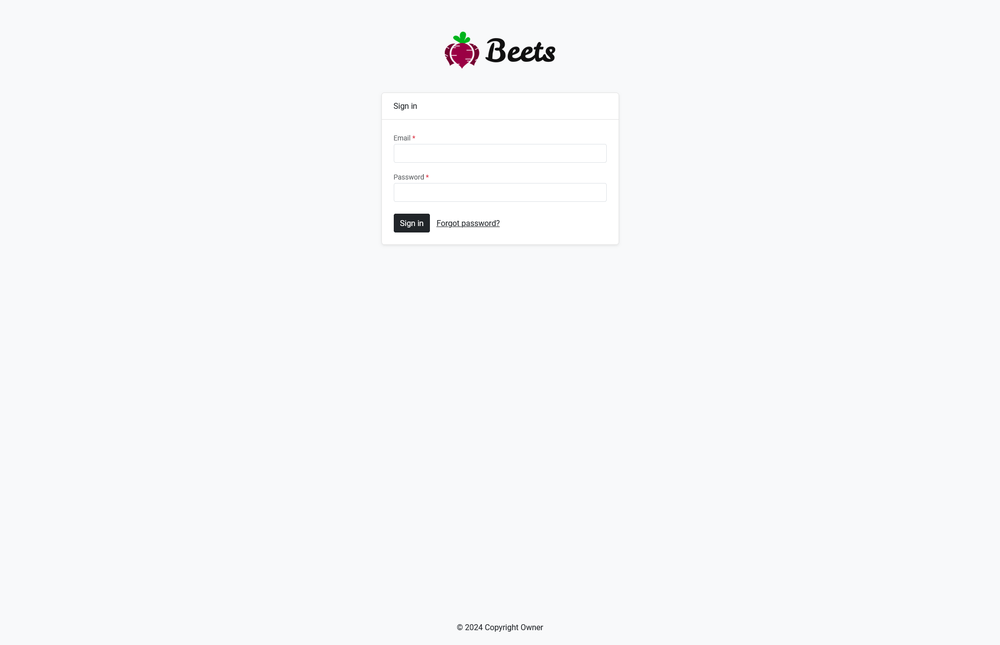

This page describes how the login and logout works.

## Logging in

You access the login page by going to `/login` or `/` when logged out.



By making a POST request to the /login route an attempt is made to match the submitted credentials. 

```html
<form method="POST" action="/login" name="login-form" id="loginForm">
	<input type="email" id="email" name="email">
	<input type="password" id="password" name="password">
	<input type="submit" value="Log in">
</form>
```

If the attempt is a success, a users session array is created and the user is redirected to the start page. The users array contains information about the user that is stored in the database, as well as its role and permissions.

To access the information in the users session, use the `User` class which have convenient methods for accessing various data, for instance `User::fullName()`. Read more about the User class [here]().

## Logging out

To log the user out you need to make a DELETE request to the /login route: 

```html
<form method="POST" action="/login">
	<?= method('DELETE') ?>
	<button type="submit">Log out</button>
</form>
```

When logging out, the user [session will be destroyed](../sessions.md#destroying-the-session), the cookies reset and the user is redirected to the start page which is now the login form.