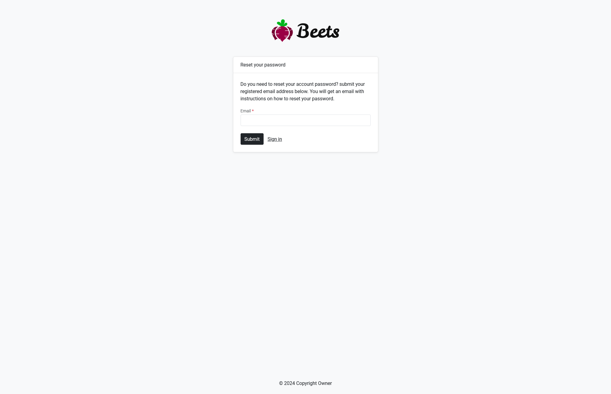
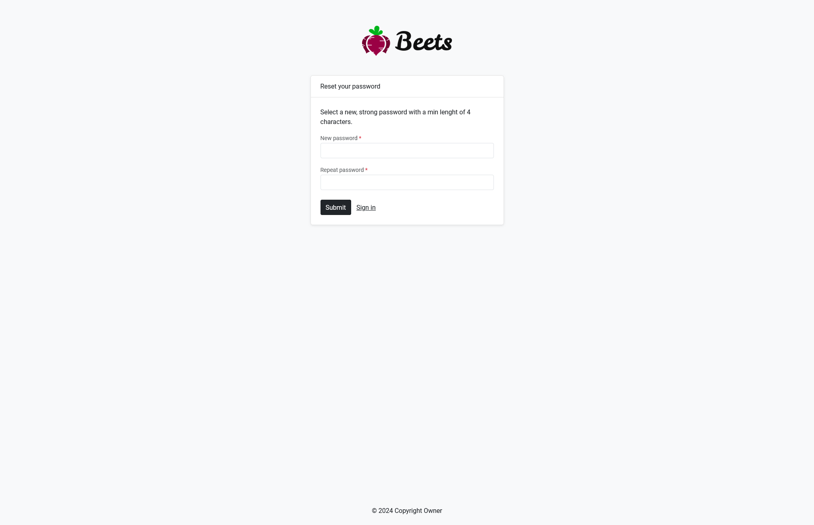
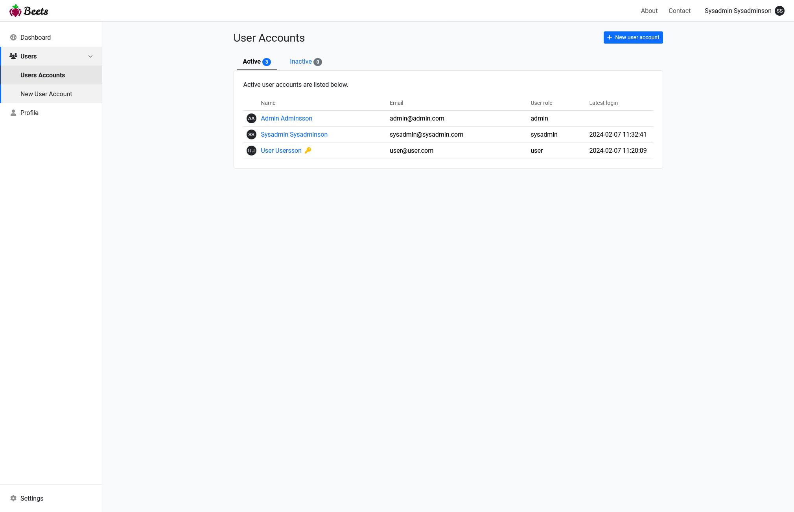
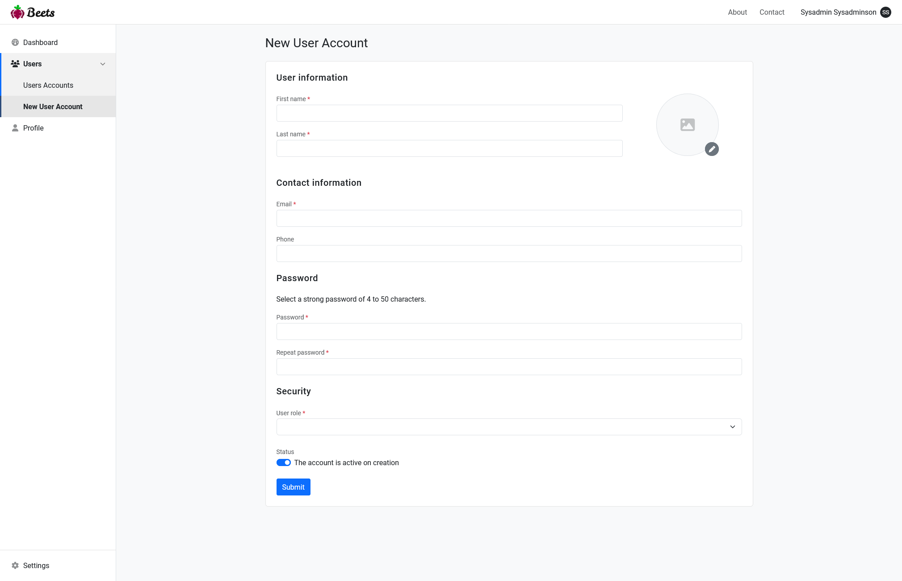
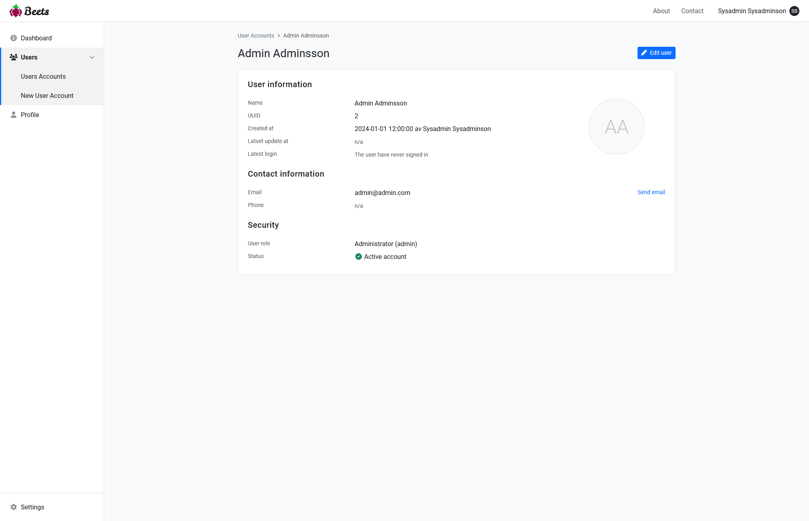
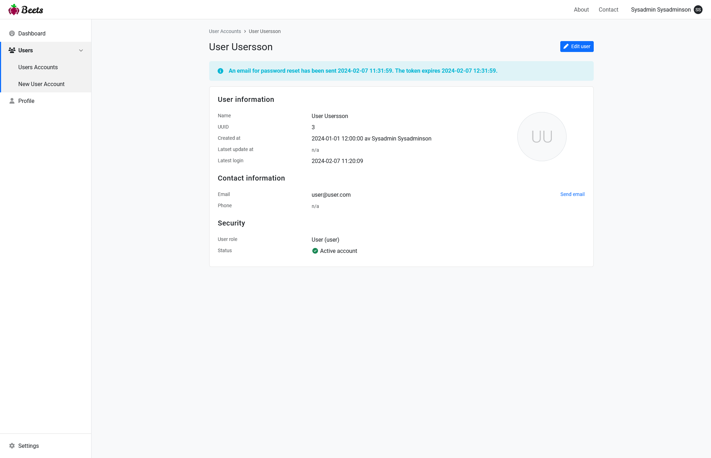
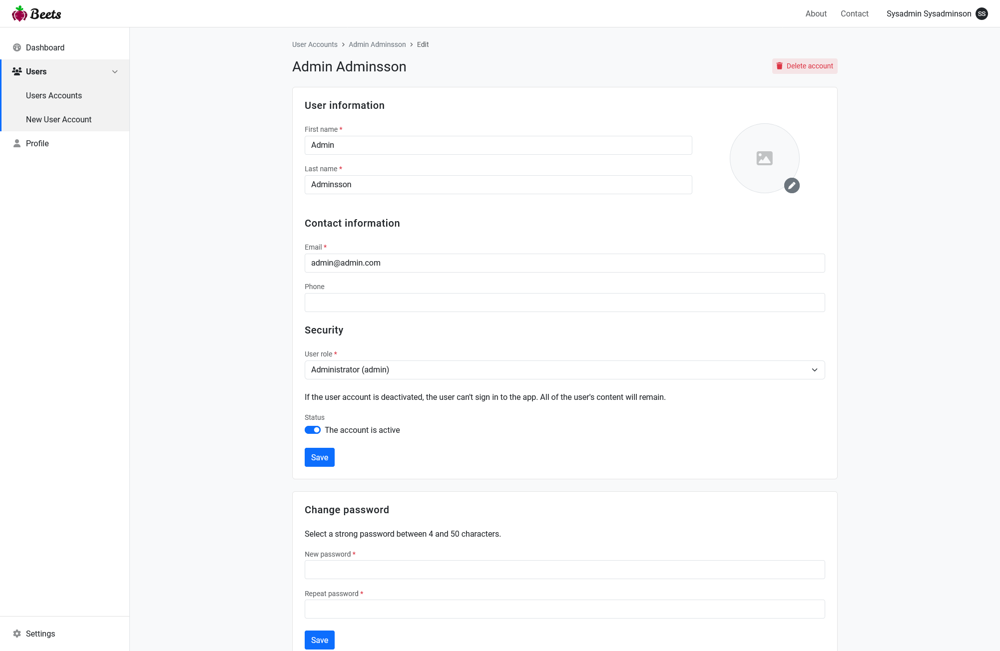
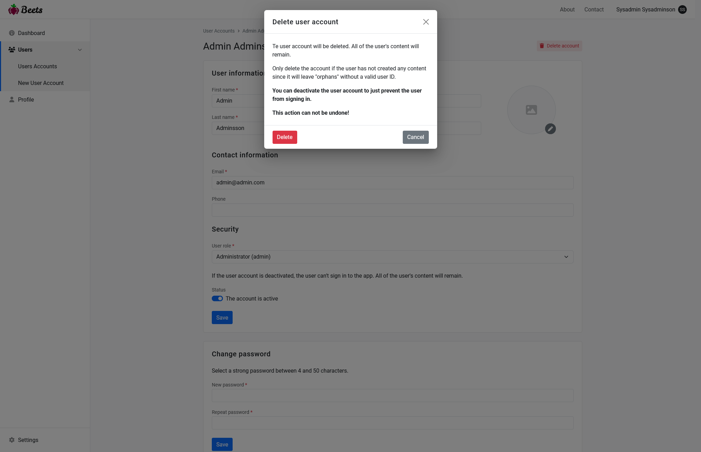

There are a couple of routes registered in `/src/routes/web.php` that are used for administate and access your user accounts. There are also some controllers, models and views to help you get started.

## Routes and controllers

The following routes are registered in `/src/routes/web.php` for the authentication controllers (and views).

### LoginController()

```php title="Location"
/src/App/Http/Controllers/Authenticate/LoginController.php
```

| Rote   | Request method | Function  | Description                 |
| ------ | -------------- | --------- | --------------------------- |
| /login | GET            | create()  | Login form                  |
| /login | POST           | store()   | Attempt logging in the user |
| /login | DELETE         | destroy() | Log out the user            |

### PasswordController()

```php title="Location"
/src/App/Http/Controllers/Authenticate/PasswordController.php
```

| Rote                | Request method | Function | Description                      |
| ------------------- | -------------- | -------- | -------------------------------- |
| /reset-password     | GET            | create() | Show reset password form         |
| /reset-password     | POST           | store()  | Generate token, send email       |
| /reset-password/new | GET            | edit()   | Show new password form           |
| /reset-password/new | PATCH          | update() | Update password, send conf email |

### UserController()

```php title="Location"
/src/App/Http/Controllers/UserController.php
```

| Rote                 | Request method | Function  | Description           |
| -------------------- | -------------- | --------- | --------------------- |
| /users               | GET            | index()   | List all users        |
| /users/{userId}      | GET            | show()    | Show a user           |
| /users/{userId}/edit | GET            | edit()    | Show user edit form   |
| /users/{userId}/edit | PATCH          | update()  | Update the user       |
| /users/{userId}/edit | DELETE         | destroy() | Delete the user       |
| /users/create        | GET            | create()  | Show create user form |
| /users/create        | POST           | store()   | Save the user         |

### ProfileController()

```php title="Location"
/src/App/Http/Controllers/ProfileController.php
```

| Rote     | Request method | Function | Description            |
| -------- | -------------- | -------- | ---------------------- |
| /profile | GET            | edit()   | Show profile edit form |
| /profile | PATCH          | update() | Update the user        |

## Views

The views are located in `/src/public/views/authenticate` and `/src/public/views/users`. The profile is located in `/src/public/views`.

### Login form

```php title="Location"
/src/public/views/authenticate/login.php
```

```php title="Path"
/login
/
```

The login form can be accessed only if you are not logged in by visiting `/login` or `/`. When a visitor is trying to access a page that requires authentication, they will be redirected to the login form.

Here is also a link to the reset password form (forgot password?).


### Reset password form

The user submits their email address to generate a password reset token and send it to their email if it's registered in the database.

```php title="Location"
/src/public/views/authenticate/reset-password.php
```

```php title="Path"
/reset-password
```



### Select new password form

This path is only available when the user has a valid password reset token.

This form lets the user chose a new password fot the account. After the password has been updated, the token is deleted and the link no longer works.

```php title="Location"
/src/public/views/authenticate/new-password.php
```

```php title="Path"
/reset-password/new?token={token}
```



### List all users

This page lists all users in the database. There are to tabs: active and inactive users. By clicking on the names you will show all the user information. If a password reset token has been created for a user, a key icon will be shown behind the name of the user.

```php title="Location"
/src/public/views/users/index.php
```

```php title="Path"
/users
```



### Create user

Here you can create a new user.

```php title="Location"
/src/public/views/users/create.php
```

```php title="Path"
/users/create
```



### Show user

Show all user information.

```php title="Location"
/src/public/views/users/show.php
```

```php title="Path"
/users/{userId}
```




### Edit and delete user

Here you can edit the user information. You can also delete the youser from this view if you have the right permissions.

**Delete or inactivate an account?**

Usually you don't want to delete a user since that might leave orphan posts in the database. You can inactivate their account instead to keep the data but preventing the user to log in.

```php title="Location"
/src/public/views/users/edit.php
```

```php title="Path"
/users/{userId}/edit
```




### Profile

This view is for the logged in user to edit their own information. It provides less inromation than the edit page for admins for security reasons. The user can also update their password from this page.

```php title="Location"
/src/public/views/profile.php
```

```php title="Path"
/profile
```

