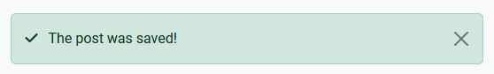
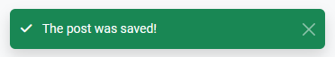

The Error class handles incomming error messages and stores them in an array.

## Feedback.php

```php title="Location"
~/app/http/Feedback.php
```

```php title="Namespace"
namespace App\Http;
```

```php title="Import"
use App\Http\Feedback;
```

## How feedbacks work

Feedbacks are not essential to Beets PHP and can be configures as you wish. The class gives you an easy way of creating "components" like alerts and toasts. They are built for use with the Bootstrap framework but can easily be changed into Tailwind CSS or anything else.

When you have executed some code, perhaps saved something to the database, you can **set** a feedback name. When you load the next page you can **create** a component and then **run** it to show it.

```php title="Example"
use App\Http\Feedback;

// Set feedback name
Feedback::set('save_success');

// Create the component
Feedback::create('save_success')->toast([
    'text' =>, 'The post was saved',
    'style' =>, 'success',
    'icon' =>, 'fa-solid fa-check-circle'
]);

// Run the feedback message
Feedback::run();
```

## Create a component

To create a component you first have to announce that something has happened, like `'save_success'`. You do this by setting a name. This will save the name to the session (`$_SESSION['feedback']`) so that it can be recieved on another page.

```php
Feedback::set('save_success');
```

You can build a feedback component when you are ready to show it. This can be done in a view but the best place is in a controller before returning the view.

By building the component you are inserting information that will be presented in the selected [feedback type](#feedback-types). 

The `for()` method will check if the name for the component you are building is in the session. If it is, the component will be built.

```php
Feedback::for('save_success')->toast();
```

## Feedback types

Two feedback types are included by default and they are both Bootstrap components. By inserting a message, style and icon you can decide how the message will look.

```php title="Properties example"
[
    'text' => "The post was saved!" // (string) The message
    'style' => "success" // (string) Bootstrap contextual class
    'icon' => "fa-solid fa-check" // (string) Fontawesome icon

    'offset-y' => "58px" // (string) Y-axis offset, only for toast
]
```

### Alert

The alert will fill the page width depending on where in you HTML you place `Feedback::run()`. It will not close automaticlly.

[Read more about Bootstrap alerts](https://getbootstrap.com/docs/5.3/components/alerts/)



```php
Feedback::for('save_success')->alert([
    'text' => "The post was saved!",
    'style' => "success",
    'icon' => "fa-solid fa-check"
]);
```

### Toast

The toast is shown at the top right corner of your screen. This can me modified within the Feedback class. The toast will disappear after 5 seconds.

[Read more about Bootstrap toasts](https://getbootstrap.com/docs/5.3/components/toasts/).



```php
Feedback::for('save_success')->toast([
    'text' => "The post was saved!",
    'style' => "success",
    'icon' => "fa-solid fa-check"
]);
```

## Run the feedback

When the component is created it's time to run it. You can either run it when creating it or later in your code depending on your needs. The `run()` method will `echo` out the component.

```php
Feedback::for('save_success')->toast(...)->run();
```
```php
Feedback::for('save_success')->toast(...);

Feedback::run();
```